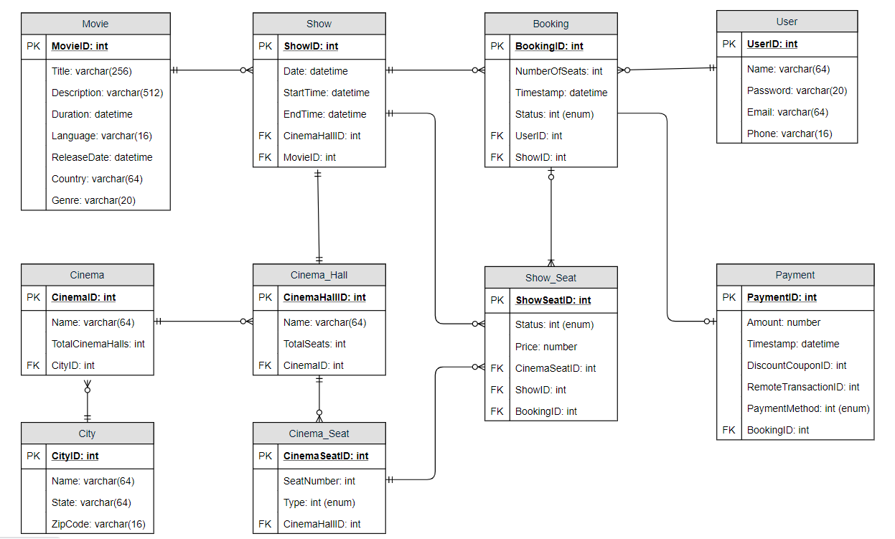
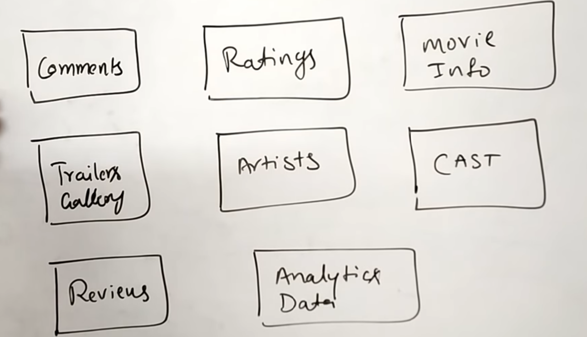
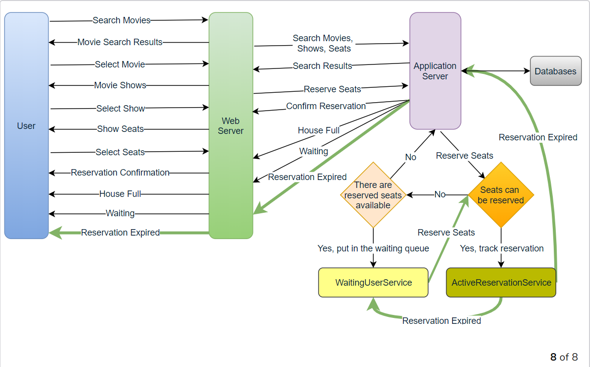
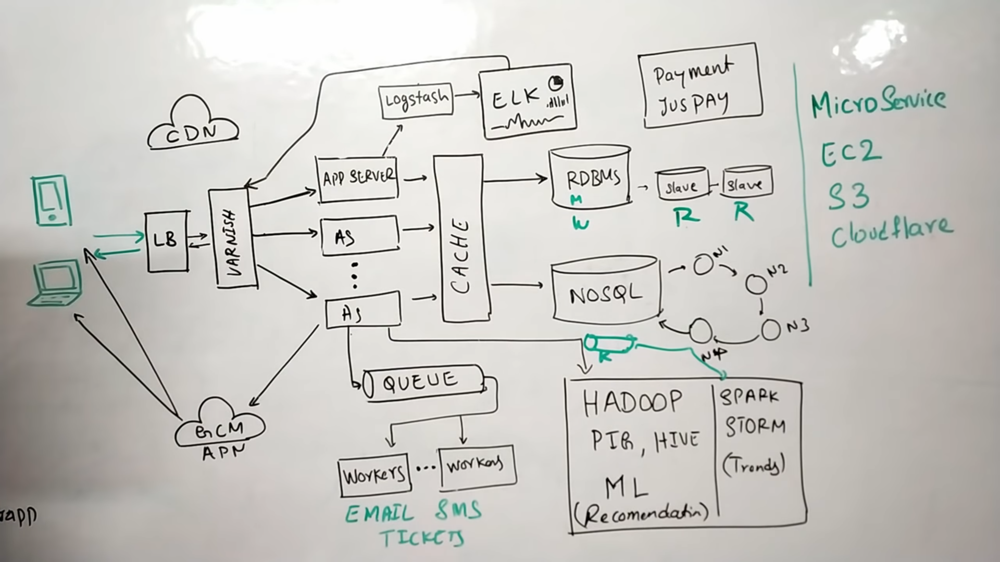
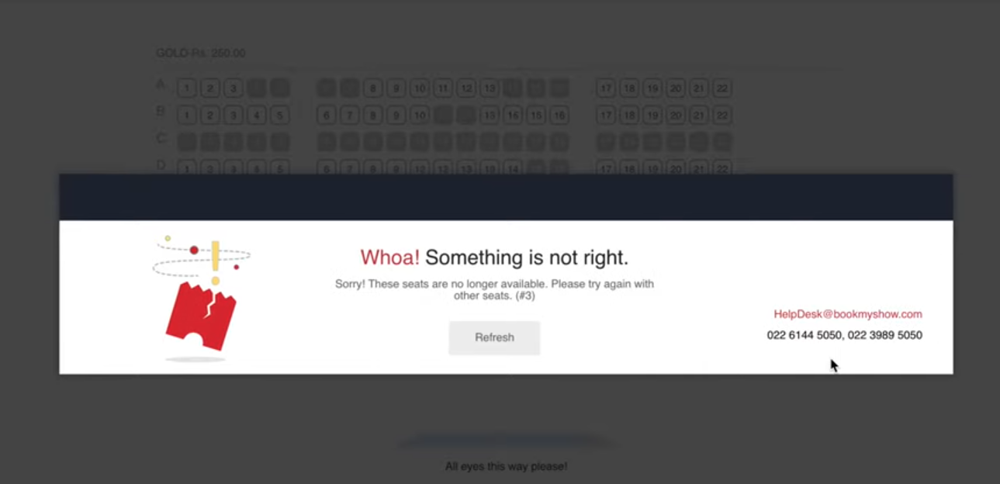
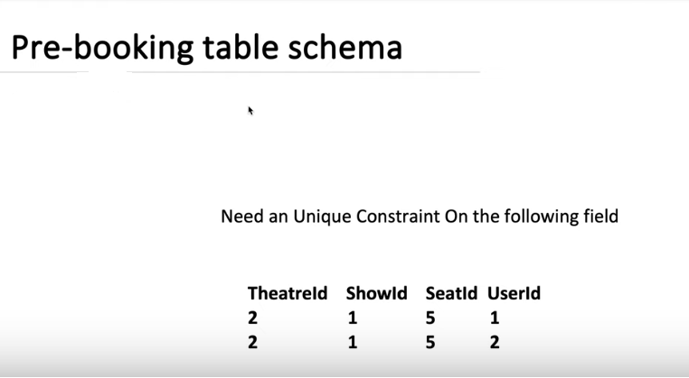
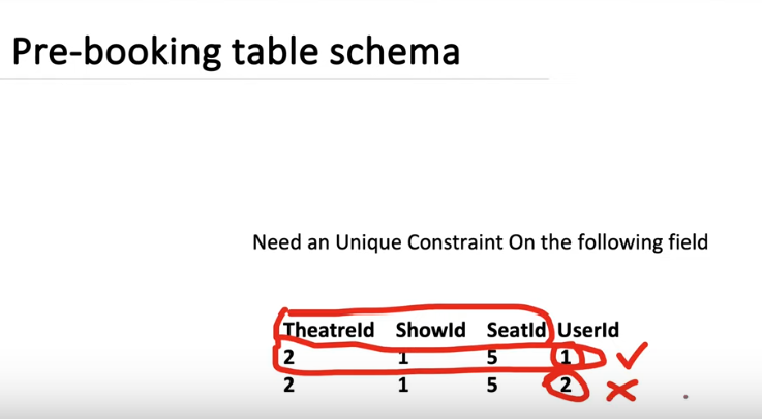

# bookmyshow-system-design
System Design for BookMyShow/Ticketing Application

A movie ticket booking system provides its customers the ability to purchase theatre seats online. E-ticketing systems allow the customers to browse through movies currently being played and to book seats, anywhere anytime.

Have a look at the Requirements :
# Functional Requirement

Our ticket booking service should meet the following requirements:

Functional Requirements:

- Search movies based upon place, theatre, show timing
- Book ticket with seat selection.
- Browse Movie information and movie review.
- Recommend movie

# Non Functional Requirements
- The system would need to be highly concurrent. There will be multiple booking requests for the same seat at any particular point in time. The service should handle this gracefully and fairly.
- The core thing of the service is ticket booking, which means financial transactions. This means that the system should be secure and the database ACID compliant.

# Basic Design and Database

## System APIs

Search Movies:

    SearchMovies(api_dev_key, keyword, city, lat_long, radius, start_datetime, end_datetime, 
    postal_code, includeSpellcheck, results_per_page, sorting_order)

Book Tickets

    ReserveSeats(api_dev_key, session_id, movie_id, show_id, seats_to_reserve[])

## DB Design
Here are a few observations about the data we are going to store:

 - Each City can have multiple Cinemas.
 - Each Cinema will have multiple halls.
 - Each Movie will have many Shows and each Show will have multiple Bookings.
- A user can have multiple bookings.

## NoSQL Tables

# The Design Flow

# Locking and unlocking of seats:

User 1 and user 2 both are trying to book the ticket for same show and same seat:

Consider a prebooking table which stores data as follows:

The constraint will make sure the next transaction will fail and the second user will see error for seat reservation.

# References

https://medium.com/@narengowda/bookmyshow-system-design-e268fefb56f5

https://www.youtube.com/watch?v=s4mO1Ak9G84

https://www.youtube.com/watch?v=lBAwJgoO3Ek&t=1379s

